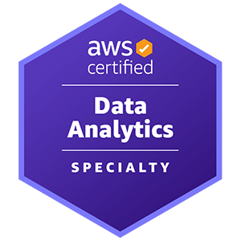

# Data-Analytics-on-AWS

The Course content:
-------------------
1. Online Lectures with AWS-Professional trainers 
2. Digital Courses 
3. Labs In qwiklabs 
4. Use Cases (Graded)
5. Exam Preparation

Online Lectures Headlines
-------------------------
1. AWS Cloud Practitioner Essentials Day
2. AWS Technical Essentials
3. Practical Data Science with Amazon SageMaker
4. Big Data on AWS Part 1
5. Big Data on AWS Part 2
6. Big Data on AWS Part 3
7. Building Data Lakes on AWS
8. Data for Machine Learning Workshop
9. Data engineering & Serverless data Part 1
10. Data engineering & Serverless data Part 2

Digital Courses On AWS SkillBuilder
-----------------------------------

| Intro to Data Science                                                                    | [Digital on Udacity](https://www.udacity.com/course/intro-to-data-science--ud359)                                                                                                                                                                                                                                   |
| ---------------------------------------------------------------------------------------- |---------------------------------------------------------------------------------------------------------------------------------------------------------------------------------------------------------------------------------------------------------------------------------------------------------------------|
| The Elements of Data Science                                                             | [Digital Course on AWS Skillbuilder](https://www.aws.training/Details/eLearning?id=26598)                                                                                                                                                                                                                           |
| Math for Machine Learning                                                                | [Digital Course on AWS Skillbuilder](https://www.aws.training/Details/eLearning?id=26597)                                                                                                                                                                                                                           |
| Linear and Logistics Regression                                                          | [Digital Course on AWS Skillbuilder](https://www.aws.training/Details/eLearning?id=26599&amp;trk=el_a134p000006gaafAAA&amp;trkCampaign=GLBL-FY21-TRAINCERT-400-ML&amp;sc_channel=el&amp;sc_campaign=GLBL-FY21-TRAINCERT-400-ML-B2IDataScientistSkillsTracker-website-eBook&amp;sc_outcome=Training_and_Certification) |
| Data Science Capstone: Real-world ML Decisions                                           | [Digital Course on AWS Skillbuilder](https://www.aws.training/Details/eLearning?id=27201)                                                                                                                                                                                                                           |
| Process Model: CRISP-DM on the AWS Stack                                                 | [Digital Course on AWS Skillbuilder](https://www.aws.training/Details/eLearning?id=27200&amp;trk=el_a134p000006gaaaAAA&amp;trkCampaign=GLBL-FY21-TRAINCERT-400-ML&amp;sc_channel=el&amp;sc_campaign=GLBL-FY21-TRAINCERT-400-ML-B2IRUG-website-eGuide&amp;sc_outcome=Training_and_Certification)                     |
| Exploring the Machine Learning Toolset                                                   | [Digital Course on AWS Skillbuilder](https://www.aws.training/Details/Curriculum?id=27155&amp;trk=el_a134p000006gaaaAAA&amp;trkCampaign=GLBL-FY21-TRAINCERT-400-ML&amp;sc_channel=el&amp;sc_campaign=GLBL-FY21-TRAINCERT-400-ML-B2IRUG-website-eGuide&amp;sc_outcome=Training_and_Certification)                    |
| Machine Learning Terminology and Process                                                 | [Digital Course on AWS Skillbuilder](https://www.aws.training/Details/eLearning?id=20294&amp;trk=el_a134p000006gaaaAAA&amp;trkCampaign=GLBL-FY21-TRAINCERT-400-ML&amp;sc_channel=el&amp;sc_campaign=GLBL-FY21-TRAINCERT-400-ML-B2IRUG-website-eGuide&amp;sc_outcome=Training_and_Certification)                     |
| Machine Learning Security                                                                | [Digital Course on AWS Skillbuilder](https://www.aws.training/Details/Curriculum?id=27273&amp;trk=el_a134p000006gaaaAAA&amp;trkCampaign=GLBL-FY21-TRAINCERT-400-ML&amp;sc_channel=el&amp;sc_campaign=GLBL-FY21-TRAINCERT-400-ML-B2IRUG-website-eGuide&amp;sc_outcome=Training_and_Certification)                     |
| Developing Machine Learning Applications                                                 | [Digital Course on AWS Skillbuilder](https://www.aws.training/Details/Curriculum?id=27243&amp;trk=el_a134p000006gaaaAAA&amp;trkCampaign=GLBL-FY21-TRAINCERT-400-ML&amp;sc_channel=el&amp;sc_campaign=GLBL-FY21-TRAINCERT-400-ML-B2IRUG-website-eGuide&amp;sc_outcome=Training_and_Certification)                     |
| Seeing Clearly: Computer Vision Theory                                                   | [Digital Course on AWS Skillbuilder](https://www.aws.training/Details/Video?id=37702&amp;trk=el_a134p000006gaaaAAA&amp;trkCampaign=GLBL-FY21-TRAINCERT-400-ML&amp;sc_channel=el&amp;sc_campaign=GLBL-FY21-TRAINCERT-400-ML-B2IRUG-website-eGuide&amp;sc_outcome=Training_and_Certification)                          |
| Amazon SageMaker: Build an Object Detection Model Using Images Labeled with Ground Truth | [Digital Course on AWS Skillbuilder](https://www.aws.training/Details/Curriculum?id=27153&amp;trk=el_a134p000006gaafAAA&amp;trkCampaign=GLBL-FY21-TRAINCERT-400-ML&amp;sc_channel=el&amp;sc_campaign=GLBL-FY21-TRAINCERT-400-ML-B2IDataScientistSkillsTracker-website-eBook&amp;sc_outcome=Training_and_Certification) |
| Speaking of: Machine Learning Translation and NLP                                        | [Digital Course on AWS Skillbuilder](https://www.aws.training/Details/Curriculum?id=27151&amp;trk=el_a134p000006gaafAAA&amp;trkCampaign=GLBL-FY21-TRAINCERT-400-ML&amp;sc_channel=el&amp;sc_campaign=GLBL-FY21-TRAINCERT-400-ML-B2IDataScientistSkillsTracker-website-eBook&amp;sc_outcome=Training_and_Certification) |
| Break Free From Legacy Databases                                                         | [Digital Course on AWS Skillbuilder](https://www.aws.training/Details/Curriculum?id=61146&amp;trkCampaign=GLBL-FY21-TRAINCERT-600-DA&amp;sc_channel=el&amp;sc_campaign=GLBL-FY21-TRAINCERT-600-DA-B2IRUG-Database-website-eGuide&amp;sc_outcome=Training_and_Certification&amp;sc_geo=mult)                            |
| PostgreSQL Fundamentals                                                                  | [Digital Course on AWS Skillbuilder](https://www.aws.training/Details/eLearning?id=32439&amp;trkCampaign=GLBL-FY21-TRAINCERT-600-DA&amp;sc_channel=el&amp;sc_campaign=GLBL-FY21-TRAINCERT-600-DA-B2IRUG-Database-website-eGuide&amp;sc_outcome=Training_and_Certification&amp;sc_geo=mult)                          |
| PostgreSQL Fundamentals – Architectures                                                  | [Digital Course on AWS Skillbuilder](https://www.aws.training/Details/eLearning?id=42102&amp;trkCampaign=GLBL-FY21-TRAINCERT-600-DA&amp;sc_channel=el&amp;sc_campaign=GLBL-FY21-TRAINCERT-600-DA-B2IRUG-Database-website-eGuide&amp;sc_outcome=Training_and_Certification&amp;sc_geo=mult)                          |
| PostgreSQL Fundamentals – SQL Command Line                                               | [Digital Course on AWS Skillbuilder](https://www.aws.training/Details/eLearning?id=43293&amp;trkCampaign=GLBL-FY21-TRAINCERT-600-DA&amp;sc_channel=el&amp;sc_campaign=GLBL-FY21-TRAINCERT-600-DA-B2IRUG-Database-website-eGuide&amp;sc_outcome=Training_and_Certification&amp;sc_geo=mult)                          |
| Amazon RDS Service Primer                                                                | [Digital Course on AWS Skillbuilder](https://www.aws.training/Details/eLearning?id=36999&amp;trkCampaign=GLBL-FY21-TRAINCERT-600-DA&amp;sc_channel=el&amp;sc_campaign=GLBL-FY21-TRAINCERT-600-DA-B2IRUG-Database-website-eGuide&amp;sc_outcome=Training_and_Certification&amp;sc_geo=mult)                          |
| Amazon Aurora MySQL - Basics                                                             | [Digital Course on AWS Skillbuilder](https://www.aws.training/Details/eLearning?id=42509&amp;trkCampaign=GLBL-FY21-TRAINCERT-600-DA&amp;sc_channel=el&amp;sc_campaign=GLBL-FY21-TRAINCERT-600-DA-B2IRUG-Database-website-eGuide&amp;sc_outcome=Training_and_Certification&amp;sc_geo=mult)                          |
| Amazon Aurora MySQL - Migration                                                          | [Digital Course on AWS Skillbuilder](https://www.aws.training/Details/eLearning?id=39639&amp;trkCampaign=GLBL-FY21-TRAINCERT-600-DA&amp;sc_channel=el&amp;sc_campaign=GLBL-FY21-TRAINCERT-600-DA-B2IRUG-Database-website-eGuide&amp;sc_outcome=Training_and_Certification&amp;sc_geo=mult)                          |
| Amazon Aurora Service Primer                                                             | [Digital Course on AWS Skillbuilder](https://www.aws.training/Details/eLearning?id=36849&amp;trkCampaign=GLBL-FY21-TRAINCERT-600-DA&amp;sc_channel=el&amp;sc_campaign=GLBL-FY21-TRAINCERT-600-DA-B2IRUG-Database-website-eGuide&amp;sc_outcome=Training_and_Certification&amp;sc_geo=mult)                          |
| Mapping a Few Core Oracle DB Concepts to Amazon RDS/Aurora PostgreSQL Concepts           | [Digital Course on AWS Skillbuilder](https://www.aws.training/Details/Video?id=26849&amp;trkCampaign=GLBL-FY21-TRAINCERT-600-DA&amp;sc_channel=el&amp;sc_campaign=GLBL-FY21-TRAINCERT-600-DA-B2IRUG-Database-website-eGuide&amp;sc_outcome=Training_and_Certification&amp;sc_geo=mult)                              |
| PostgreSQL Fundamentals: Explain                                                         | [Digital Course on AWS Skillbuilder](https://www.aws.training/Details/eLearning?id=43291&amp;trkCampaign=GLBL-FY21-TRAINCERT-600-DA&amp;sc_channel=el&amp;sc_campaign=GLBL-FY21-TRAINCERT-600-DA-B2IRUG-Database-website-eGuide&amp;sc_outcome=Training_and_Certification&amp;sc_geo=mult)                          |
| Amazon DynamoDB Service Primer                                                           | [Digital Course on AWS Skillbuilder](https://www.aws.training/Details/eLearning?id=36858&amp;trkCampaign=GLBL-FY21-TRAINCERT-600-DA&amp;sc_channel=el&amp;sc_campaign=GLBL-FY21-TRAINCERT-600-DA-B2IRUG-Database-website-eGuide&amp;sc_outcome=Training_and_Certification&amp;sc_geo=mult)                             |
| Amazon DynamoDB for Serverless Architectures                                             | [Digital Course on AWS Skillbuilder](https://www.aws.training/Details/eLearning?id=27196&amp;trkCampaign=GLBL-FY21-TRAINCERT-600-DA&amp;sc_channel=el&amp;sc_campaign=GLBL-FY21-TRAINCERT-600-DA-B2IRUG-Database-website-eGuide&amp;sc_outcome=Training_and_Certification&amp;sc_geo=mult)                          |
| Amazon DynamoDB – Architecture and Features                                              | [Digital Course on AWS Skillbuilder](https://www.aws.training/Details/eLearning?id=50877&amp;trkCampaign=GLBL-FY21-TRAINCERT-600-DA&amp;sc_channel=el&amp;sc_campaign=GLBL-FY21-TRAINCERT-600-DA-B2IRUG-Database-website-eGuide&amp;sc_outcome=Training_and_Certification&amp;sc_geo=mult)                          |
| Amazon ElastiCache Service Introduction                                                  | [Digital Course on AWS Skillbuilder](https://www.aws.training/Details/Video?id=36892&amp;trkCampaign=GLBL-FY21-TRAINCERT-600-DA&amp;sc_channel=el&amp;sc_campaign=GLBL-FY21-TRAINCERT-600-DA-B2IRUG-Database-website-eGuide&amp;sc_outcome=Training_and_Certification&amp;sc_geo=mult)                              |
| Amazon Neptune Service Introduction                                                      | [Digital Course on AWS Skillbuilder](https://www.aws.training/Details/Video?id=36895&amp;trkCampaign=GLBL-FY21-TRAINCERT-600-DA&amp;sc_channel=el&amp;sc_campaign=GLBL-FY21-TRAINCERT-600-DA-B2IRUG-Database-website-eGuide&amp;sc_outcome=Training_and_Certification&amp;sc_geo=mult)                              |
| Amazon Quantum Ledger Database (QLDB) Service Introduction                               | [Digital Course on AWS Skillbuilder](https://www.aws.training/Details/Video?id=40817&amp;trkCampaign=GLBL-FY21-TRAINCERT-600-DA&amp;sc_channel=el&amp;sc_campaign=GLBL-FY21-TRAINCERT-600-DA-B2IRUG-Database-website-eGuide&amp;sc_outcome=Training_and_Certification&amp;sc_geo=mult)                              |
| Amazon Redshift Service Introduction                                                     | [Digital Course on AWS Skillbuilder](https://www.aws.training/Details/Video?id=36954&amp;trkCampaign=GLBL-FY21-TRAINCERT-600-DA&amp;sc_channel=el&amp;sc_campaign=GLBL-FY21-TRAINCERT-600-DA-B2IRUG-Database-website-eGuide&amp;sc_outcome=Training_and_Certification&amp;sc_geo=mult)                              |
| Application development using AWS DynamoDB                                               | [Digital Course on AWS Skillbuilder](https://www.aws.training/Details/Curriculum?id=65583&amp;trkCampaign=GLBL-FY21-TRAINCERT-600-DA&amp;sc_channel=el&amp;sc_campaign=GLBL-FY21-TRAINCERT-600-DA-B2IRUG-Database-website-eGuide&amp;sc_outcome=Training_and_Certification&amp;sc_geo=mult)                         |
| Building Highly Connected Applications using Amazon Neptune                              | [Digital Course on AWS Skillbuilder](https://www.aws.training/Details/Video?id=41763&amp;trkCampaign=GLBL-FY21-TRAINCERT-600-DA&amp;sc_channel=el&amp;sc_campaign=GLBL-FY21-TRAINCERT-600-DA-B2IRUG-Database-website-eGuide&amp;sc_outcome=Training_and_Certification&amp;sc_geo=mult)                              |
| Deep Dive into DocumentDB                                                                | [Digital Course on AWS Skillbuilder](https://www.aws.training/Details/Video?id=41766&amp;trkCampaign=GLBL-FY21-TRAINCERT-600-DA&amp;sc_channel=el&amp;sc_campaign=GLBL-FY21-TRAINCERT-600-DA-B2IRUG-Database-website-eGuide&amp;sc_outcome=Training_and_Certification&amp;sc_geo=mult)                              |
| Build Modern Apps with Purpose-Built Databases                                           | [Digital  Course on AWS Skillbuilder](https://www.aws.training/Details/Curriculum?id=66059&amp;trkCampaign=GLBL-FY21-TRAINCERT-600-DA&amp;sc_channel=el&amp;sc_campaign=GLBL-FY21-TRAINCERT-600-DA-B2IRUG-Database-website-eGuide&amp;sc_outcome=Training_and_Certification&amp;sc_geo=mult)                        |
| AWS Analytics Services Overview                                                          | [Digital  Course on AWS Skillbuilder](https://www.aws.training/Details/Video?id=16202)                                                                                                                                                                                                                                 |
| Introduction to Amazon Kinesis Streams                                                   | [Digital  Course on AWS Skillbuilder](https://www.aws.training/Details/Video?id=15880)                                                                                                                                                                                                                              |
| Introduction to Amazon Kinesis Firehose                                                  | [Digital  Course on AWS Skillbuilder](https://www.aws.training/Details/Video?id=16359)                                                                                                                                                                                                                              |
| Introduction to Amazon Kinesis Analytics                                                 | [Digital  Course on AWS Skillbuilder](https://www.aws.training/Details/Video?id=16415)                                                                                                                                                                                                                              |
| Introduction to Amazon Elastic MapReduce (EMR)                                           | [Digital  Course on AWS Skillbuilder](https://www.aws.training/Details/Video?id=16023)                                                                                                                                                                                                                              |
| Introduction to Amazon Athena                                                            | [Digital  Course on AWS Skillbuilder](https://www.aws.training/Details/Video?id=15885)                                                                                                                                                                                                                              |
| Introduction to Amazon QuickSight                                                        | [Digital  Course on AWS Skillbuilder](https://www.aws.training/Details/Video?id=16370)                                                                                                                                                                                                                              |
| Visualizing with QuickSight                                                              | [Digital  Course on AWS Skillbuilder](https://www.aws.training/Details/Curriculum?id=35944)                                                                                                                                                                                                                         |
| Introduction to AWS IoT Analytics                                                        | [Digital Course on AWS Skillbuilder](https://www.aws.training/Details/Video?id=19879)                                                                                                                                                                                                                               |
| Deep Dive into Concepts and Tools for Analyzing Streaming Data                           | [Digital  Course on AWS Skillbuilder](https://www.aws.training/Details/Video?id=27504)                                                                                                                                                                                                                                 |
| Best Practices for Data Warehousing with Amazon Redshift                                 | [Digital Course on AWS Skillbuilder](https://www.aws.training/Details/Video?id=26851)                                                                                                                                                                                                                               |
| Serverless Analytics                                                                     | [Digital Course on AWS Skillbuilder](https://www.aws.training/Details/Video?id=26848)                                                                                                                                                                                                                               |

Exam Preparation:
----------------
1. [AWS Certified Data Analytics Specialty 2022 - Hands On!](https://www.udemy.com/course/aws-data-analytics/)
2. [Exam Topics Questions](https://www.examtopics.com/exams/amazon/aws-certified-data-analytics-specialty/)

